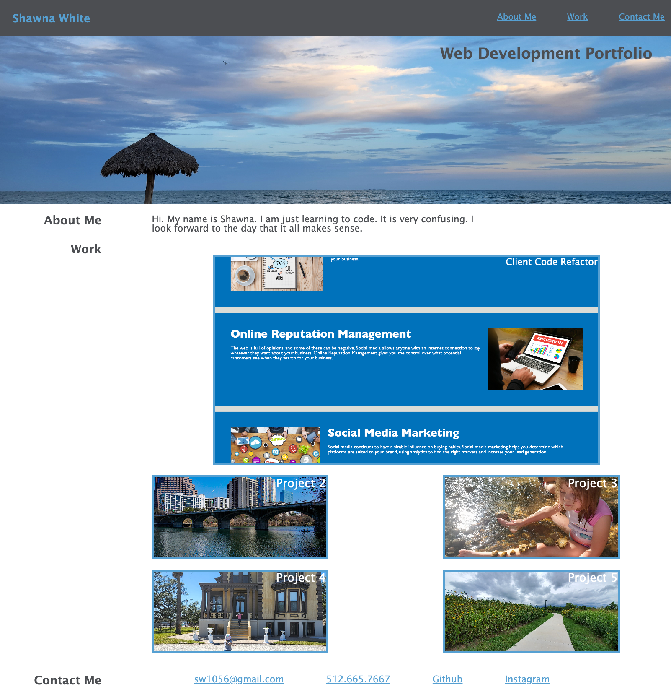

# Challenge 2: Create a Portfolio Webpage

## User Story

AS A beginning developer
I WANT to create a professional portfolio of work samples
SO THAT potential employers can review my work and determine whether I'm a good candidate for an open position

## Acceptance Criteria

It is done
WHEN I create a public portfolio webpage for potential employer's to view
THEN they see my name, a banner photo, and links to three sections: about me, work, and contact info
WHEN I create navbar links for each section
THEN they scroll to the appropriate section when clicked
WHEN I create project cards in the 'work' section with images and titles
THEN the page scrolls to those cards when the 'work' nav link is clicked
WHEN I create a project card for my first deployed application
THEN that card is larger in size than the other project cards
WHEN I create links to each project card
THEN the link directs the user to that deployed application when clicked
WHEN I create a responsive design layout
THEN the page displays appropriate given the user's screen size

## Screenshot

## Deployed Application

https://shawnawhite3699.github.io/portfolio/